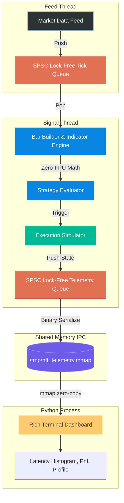

# OS-Max High-Frequency Trading Engine

An (non) institutional-grade, highly-optimized High-Frequency Trading (HFT) C++ framework designed for low latency strategy execution.

## Architecture

The OS-Max Engine is built entirely on C++20 POSIX threads utilizing a lock-free Single-Producer-Single-Consumer (SPSC) ring buffer architecture. It entirely bypasses OS context-switching and standard library locks on the hot path by leveraging thread affinity and kernel-level memory barriers.

### Core Pipelines



1. **Feed Thread (Core 2)**: Ingests market data ticks either via Random Walk simulation or an ultra-fast CSV replay (`CsvReplayFeed`). Pushes data directly onto the SPSC lock-free tick queue.
2. **Signal Thread (Core 3)**: Consumes market ticks from the Feed ring buffer, builds OHLCV bars, and computes TA indicators using a **Zero-FPU Fixed-Point math pipeline**. It executes the trading strategy and routes trade intents to the natively embedded `ExecutionSimulator`.
3. **Telemetry IPC Thread**: Consumes execution states, latency metrics, and signals, serializing them into tightly packed binary C-structs and dumping them straight into a 16MB `/tmp/hft_telemetry.mmap` lock-free shared memory ring buffer.

## Zero-FPU Fixed-Point Math

To eliminate floating-point non-determinism, subnormal execution stalls, and FPU calculation latency, **the entire critical execution path runs exclusively on 64-bit and 128-bit scaled integers**.
Prices and Indicators are scaled by `PRICE_SCALE = 1,000,000`, ensuring deterministic and incredibly fast cache-line execution for the VWAP, RSI, ATR, and EMA indicators.

## Measured Benchmarks

We monitor our foundational bottlenecks to ensure market-leading latency bounds.

- **Lock-Free Queue Throughput**: **236.06 Million Msgs/Sec**
- **Average Tick-to-Signal Latency**: Dynamically monitored and tracked via our embedded 6-bin cycle-latency histogram (Accessible on the Python Dashboard in realtime).
- **Serialization Overhead**: **0 bytes**. We entirely replaced `libzmq` and JSON-string parsing with pure native Memory Mapped (`mmap`) ring buffers, ensuring zero-copy reads by the dashboard and zero `snprintf` allocations on the hot path.

## Live Dashboard & Execution Simulator

The Python-based command-line dashboard hooks directly into the `/tmp/hft_telemetry.mmap` block.
The engine itself mathematically simulates true PnL execution via an embedded `ExecutionSimulator` inside the C++ Signal loop, crossing against the real Bid/Ask spread and calculating precise realized PnL.

The dashboard renders:

- Live Account Equity & Realized PnL Profile
- Total Trades & Win-Rate Statistics
- Tick-to-Signal Nanosecond Histogram
- Real-Time Live Strategy Signals stream

### How to Build & Run

```bash
# Compile the highly-optimized C++ Engine
make clean && make release

# Run the Core Ring Buffer Benchmark
make bench_spsc
./bench_spsc

# Run the live engine (Random Walk)
./hft_engine

# Run the live engine (CSV Historical Market Replay)
./hft_engine test_ticks.csv
```
